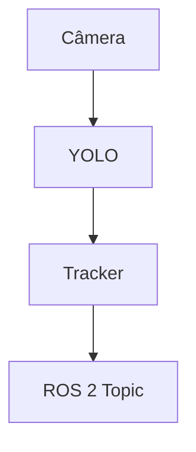

# 🚀 Módulo 4.3: Protótipos e Aplicações Reais

**Da ideia ao produto: construa soluções robóticas completas prontas para o mercado**

---

## 📋 Informações do Módulo

| Atributo | Detalhes |
|----------|----------|
| **Duração estimada** | 10-13 horas |
| **Nível** | Profissional |
| **Pré-requisitos** | Módulo 4.1 + 4.2 |
| **Tipo** | Projeto + Integração |

---

## 🎯 Objetivos de Aprendizado

Ao completar este módulo, você será capaz de:

- ✅ Transformar conceitos em protótipos funcionais
- ✅ Integrar hardware, software e IA em sistema coeso
- ✅ Conduzir testes de campo estruturados
- ✅ Iterar baseado em feedback de usuários reais
- ✅ Criar documentação técnica profissional
- ✅ Apresentar resultados para stakeholders
- ✅ Planejar próximos passos (MVP → Produto)

---

## 📚 Conteúdo Teórico

### 1. Da Ideia ao Protótipo

#### 1.1 Metodologia de Desenvolvimento

**Abordagem tradicional (Waterfall) ❌**
```
Requisitos (3 meses) → Design (2 meses) → Implementação (6 meses)
→ Testes (2 meses) → Lançamento
= 13 meses para descobrir se funciona
```

**Abordagem Ágil (Recomendada) ✅**
```
Semana 1-2: MVP funcional (20% features)
Semana 3: Teste com 5 usuários
Semana 4: Iterar baseado em feedback
Semana 5-6: Adicionar features críticas
Semana 7: Teste com 20 usuários
Semana 8: Refinar e preparar lançamento
= 8 semanas para produto validado
```

---

#### 1.2 Framework de Prototipação Rápida

**FASE 1: Definição (1-2 dias)**

Responda com precisão:

```markdown
## Problem Statement
Em uma frase: qual problema você resolve?
Exemplo: "Recepção de hotéis é cara e inconsistente"

## Target User
Quem exatamente?
Exemplo: "Hotéis 3-4 estrelas de 50-200 quartos em São Paulo"

## Success Metrics
Como medir sucesso?
Exemplo:
- 80% hóspedes preferem robô vs humano
- Reduz custo recepção em 40%
- NPS > 8.0
```

---

**FASE 2: Especificação Mínima (2-3 dias)**

Liste funcionalidades ESSENCIAIS:

```markdown
## Must-Have (Protótipo não funciona sem)
- [ ] Andar 50m sem cair
- [ ] Reconhecer pessoa a 2m de distância
- [ ] Responder 10 perguntas comuns
- [ ] Duração bateria: 4 horas

## Should-Have (Importante, mas não bloqueante)
- [ ] Expressões faciais
- [ ] Múltiplos idiomas
- [ ] Integração com sistema do hotel

## Nice-to-Have (Para versão futura)
- [ ] Carregar bagagens
- [ ] Dançar
- [ ] Selfies com hóspedes
```

**Regra de ouro:** Protótipo tem MAX 5 must-haves!

---

**FASE 3: Prototipação Rápida (1-2 semanas)**

**Exemplo: Robô Recepcionista**

```python
# Arquitetura do Protótipo
class ReceptionistRobot:
    def __init__(self):
        # Hardware
        self.robot = Bumi()
        self.camera = RGBDCamera()
        self.microphone = USBMicrophone()
        self.speaker = Speaker()

        # Software / IA
        self.face_detector = FaceDetector()
        self.speech_recognition = Whisper()
        self.llm = GPT4() # ou modelo local
        self.tts = TextToSpeech()
        self.navigation = Nav2()

        # Estado
        self.current_guest = None
        self.mode = "idle"  # idle, greeting, answering, guiding

    def run(self):
        """Loop principal"""
        while True:
            if self.mode == "idle":
                self.detect_approaching_guest()
            elif self.mode == "greeting":
                self.greet_guest()
            elif self.mode == "answering":
                self.handle_conversation()
            elif self.mode == "guiding":
                self.guide_to_location()

    def detect_approaching_guest(self):
        """Detecta quando alguém se aproxima"""
        faces = self.face_detector.detect(self.camera.get_frame())

        for face in faces:
            distance = self.estimate_distance(face)
            if distance < 2.0:  # menos de 2 metros
                self.mode = "greeting"
                self.current_guest = face
                return

    def greet_guest(self):
        """Saudação inicial"""
        # Linguagem corporal
        self.robot.wave_hand()

        # Fala
        greeting = "Olá! Bem-vindo ao Hotel Plaza. Como posso ajudar?"
        self.speak(greeting)

        # Espera resposta
        self.mode = "answering"

    def handle_conversation(self):
        """Conversa com hóspede"""
        # 1. Captura áudio
        audio = self.microphone.listen(timeout=10)

        # 2. Transcreve
        text = self.speech_recognition.transcribe(audio)

        # 3. Detecta intenção
        intent = self.classify_intent(text)

        # 4. Responde
        if intent == "where_is_room":
            response = self.answer_room_location(text)
        elif intent == "where_is_restaurant":
            response = "O restaurante fica no 3º andar. Posso guiá-lo até lá?"
        elif intent == "goodbye":
            response = "Foi um prazer ajudar! Tenha uma ótima estadia!"
            self.mode = "idle"
        else:
            # Fallback: usa LLM para resposta genérica
            response = self.llm.generate_response(text, context="hotel receptionist")

        self.speak(response)

    def classify_intent(self, text):
        """Classifica intenção da pergunta"""
        # Simples keyword matching para protótipo
        text_lower = text.lower()

        if any(word in text_lower for word in ["quarto", "room", "suite"]):
            return "where_is_room"
        elif any(word in text_lower for word in ["restaurante", "comida", "jantar"]):
            return "where_is_restaurant"
        elif any(word in text_lower for word in ["obrigado", "tchau", "até"]):
            return "goodbye"
        else:
            return "general_question"

    def speak(self, text):
        """Fala com voz natural"""
        audio = self.tts.synthesize(text, voice="pt-BR-female")
        self.speaker.play(audio)

# Executar
robot = ReceptionistRobot()
robot.run()
```

**Tempo de desenvolvimento:**
- Hardware setup: 2 dias
- Software core: 3 dias
- Integração: 2 dias
- Testes iniciais: 1 dia
- **Total: 8 dias** para protótipo funcional!

---

**FASE 4: Teste Piloto (1 semana)**

Testar com usuários REAIS, não colegas de trabalho!

**Protocolo de Teste:**

```markdown
## Preparação
- Local: Lobby de hotel parceiro
- Horário: 14h-18h (check-in peak)
- Equipe: 1 operador técnico + 1 observador UX
- Equipamento: Robô + câmera para gravar interações

## Cenários de Teste
1. Hóspede pergunta onde fica o quarto 305
2. Hóspede pergunta sobre café da manhã
3. Hóspede pede recomendação de restaurante
4. Hóspede fala em inglês
5. Duas pessoas chegam ao mesmo tempo (edge case)

## Dados a Coletar
- Taxa de conclusão (pergunta foi respondida?)
- Tempo médio de interação
- Necessidade de intervenção humana
- Satisfação (NPS 0-10)
- Problemas técnicos (log detalhado)
```

---

**FASE 5: Iteração (1-2 semanas)**

Baseado nos testes, priorize melhorias:

**Exemplo de Feedback Real:**
- "Robô não entendeu meu sotaque nordestino" (5 ocorrências)
- "Voz dele é robótica demais" (8 ocorrências)
- "Não sabia que podia tocar nele, achei que ia quebrar" (3 ocorrências)
- "Demorou 15 segundos pra responder" (10 ocorrências)

**Ações:**
1. 🔥 **CRÍTICO:** Reduzir latência (15s → 3s)
   - Usar modelo LLM local (não cloud)
   - Otimizar pipeline STT → LLM → TTS
2. 🔥 **CRÍTICO:** Melhorar reconhecimento de voz
   - Fine-tunar Whisper com sotaques brasileiros
   - Adicionar confirmação visual (mostra transcrição em tela)
3. 🟡 **IMPORTANTE:** Voz mais natural
   - Trocar TTS para ElevenLabs ou similar
4. 🟢 **NICE TO HAVE:** Indicações visuais de interação
   - LED piscando quando escutando
   - Tela: "Pode tocar em mim!"

---

### 2. Integração de Sistemas Complexos

#### 2.1 Arquitetura de Software Profissional

**Sistema completo tem múltiplos subsistemas:**

```
┌─────────────────────────────────────────────────────────┐
│                    USER INTERFACE                       │
│  Dashboard Web | App Mobile | Voz | Touchscreen        │
└────────────────────┬────────────────────────────────────┘
                     ↓
┌─────────────────────────────────────────────────────────┐
│                 APPLICATION LAYER                       │
│  Business Logic | State Machine | Task Planner         │
└────────┬────────────────────┬────────────────────┬──────┘
         ↓                    ↓                    ↓
┌─────────────────┐  ┌─────────────────┐  ┌───────────────┐
│   PERCEPTION    │  │    COGNITION    │  │    ACTION     │
│                 │  │                 │  │               │
│ - Vision        │  │ - NLU           │  │ - Navigation  │
│ - Audio         │  │ - Dialog Mgmt   │  │ - Manipulation│
│ - Lidar         │  │ - Decision      │  │ - Gestures    │
└────────┬────────┘  └────────┬────────┘  └───────┬───────┘
         ↓                    ↓                    ↓
┌─────────────────────────────────────────────────────────┐
│                   MIDDLEWARE (ROS 2)                    │
│  Topics | Services | Actions | Parameters              │
└────────────────────┬────────────────────────────────────┘
                     ↓
┌─────────────────────────────────────────────────────────┐
│                  HARDWARE DRIVERS                       │
│  Motors | Cameras | Sensors | Battery | Network        │
└─────────────────────────────────────────────────────────┘
```

---

#### 2.2 Padrões de Integração

**Padrão 1: Event-Driven Architecture**

Componentes reagem a eventos, não polling constante.

```python
from enum import Enum
from typing import Callable, Dict, List

class Event(Enum):
    PERSON_DETECTED = "person_detected"
    SPEECH_RECOGNIZED = "speech_recognized"
    TASK_COMPLETED = "task_completed"
    BATTERY_LOW = "battery_low"
    OBSTACLE_DETECTED = "obstacle_detected"

class EventBus:
    """Barramento de eventos centralizado"""
    def __init__(self):
        self.subscribers: Dict[Event, List[Callable]] = {}

    def subscribe(self, event: Event, callback: Callable):
        if event not in self.subscribers:
            self.subscribers[event] = []
        self.subscribers[event].append(callback)

    def publish(self, event: Event, data=None):
        if event in self.subscribers:
            for callback in self.subscribers[event]:
                callback(data)

# Uso
event_bus = EventBus()

# Componente de Visão publica evento
def on_person_detected(person_data):
    event_bus.publish(Event.PERSON_DETECTED, person_data)

# Componente de Greeting assina evento
def handle_person_detected(person_data):
    print(f"Greeting person at {person_data['position']}")
    robot.greet()

event_bus.subscribe(Event.PERSON_DETECTED, handle_person_detected)

# Componente de Bateria publica evento
def check_battery():
    if battery.level < 20:
        event_bus.publish(Event.BATTERY_LOW, {"level": battery.level})

# Multiple subscribers do mesmo evento
event_bus.subscribe(Event.BATTERY_LOW, lambda d: robot.go_to_charging_station())
event_bus.subscribe(Event.BATTERY_LOW, lambda d: send_alert_to_ops_team(d))
```

---

**Padrão 2: State Machine (Máquina de Estados)**

Robô está sempre em um estado específico.

```python
from enum import Enum, auto

class RobotState(Enum):
    IDLE = auto()
    APPROACHING_GUEST = auto()
    GREETING = auto()
    LISTENING = auto()
    THINKING = auto()
    RESPONDING = auto()
    GUIDING = auto()
    CHARGING = auto()
    ERROR = auto()

class StateMachine:
    def __init__(self):
        self.state = RobotState.IDLE
        self.transitions = {
            RobotState.IDLE: [RobotState.APPROACHING_GUEST, RobotState.CHARGING],
            RobotState.APPROACHING_GUEST: [RobotState.GREETING, RobotState.IDLE],
            RobotState.GREETING: [RobotState.LISTENING],
            RobotState.LISTENING: [RobotState.THINKING, RobotState.IDLE],
            RobotState.THINKING: [RobotState.RESPONDING],
            RobotState.RESPONDING: [RobotState.LISTENING, RobotState.IDLE],
            # ... etc
        }

    def transition_to(self, new_state: RobotState):
        """Transição segura de estados"""
        if new_state not in self.transitions[self.state]:
            raise ValueError(f"Invalid transition: {self.state} -> {new_state}")

        print(f"State change: {self.state.name} → {new_state.name}")
        self.state = new_state
        self.on_enter_state(new_state)

    def on_enter_state(self, state: RobotState):
        """Executado ao entrar em novo estado"""
        if state == RobotState.GREETING:
            robot.wave_hand()
            robot.speak("Olá!")
        elif state == RobotState.LISTENING:
            robot.activate_microphone()
            robot.show_listening_animation()
        elif state == RobotState.CHARGING:
            robot.navigate_to_dock()
        # ... etc

# Uso
sm = StateMachine()

# Eventos triggam transições
event_bus.subscribe(Event.PERSON_DETECTED, lambda d: sm.transition_to(RobotState.APPROACHING_GUEST))
event_bus.subscribe(Event.SPEECH_RECOGNIZED, lambda d: sm.transition_to(RobotState.THINKING))
```

---

**Padrão 3: Plugin Architecture**

Facilita adicionar novas funcionalidades sem modificar core.

```python
from abc import ABC, abstractmethod

class SkillPlugin(ABC):
    """Interface para skills do robô"""

    @abstractmethod
    def can_handle(self, user_input: str) -> bool:
        """Retorna True se esse plugin pode responder"""
        pass

    @abstractmethod
    def execute(self, user_input: str) -> str:
        """Executa a skill e retorna resposta"""
        pass

# Implementações concretas
class DirectionsSkill(SkillPlugin):
    def can_handle(self, user_input: str) -> bool:
        keywords = ["onde fica", "como chegar", "direção"]
        return any(kw in user_input.lower() for kw in keywords)

    def execute(self, user_input: str) -> str:
        # Parse location
        location = self.extract_location(user_input)
        directions = self.map.get_directions(location)
        return f"Para chegar ao {location}, {directions}"

class WeatherSkill(SkillPlugin):
    def can_handle(self, user_input: str) -> bool:
        keywords = ["tempo", "temperatura", "clima"]
        return any(kw in user_input.lower() for kw in keywords)

    def execute(self, user_input: str) -> str:
        weather = self.weather_api.get_current()
        return f"Agora está {weather.temp}°C, {weather.condition}"

class FallbackSkill(SkillPlugin):
    """Sempre pode responder (usando LLM)"""
    def can_handle(self, user_input: str) -> bool:
        return True

    def execute(self, user_input: str) -> str:
        return self.llm.generate_response(user_input)

# Manager
class SkillManager:
    def __init__(self):
        self.skills: List[SkillPlugin] = []

    def register_skill(self, skill: SkillPlugin):
        self.skills.append(skill)

    def handle_input(self, user_input: str) -> str:
        # Primeira skill que pode responder, executa
        for skill in self.skills:
            if skill.can_handle(user_input):
                return skill.execute(user_input)
        return "Desculpe, não entendi."

# Setup
manager = SkillManager()
manager.register_skill(DirectionsSkill())
manager.register_skill(WeatherSkill())
manager.register_skill(FallbackSkill())  # Sempre por último!

# Uso
response = manager.handle_input("Onde fica o restaurante?")
```

---

### 3. Testes de Campo Estruturados

#### 3.1 Metodologia de Testes

**Tipos de Testes:**

**1. Teste Alpha (Interno)**
- **Onde:** Laboratório controlado
- **Quem:** Equipe de desenvolvimento
- **Foco:** Funcionalidade básica, bugs críticos
- **Duração:** 1 semana

**2. Teste Beta (Privado)**
- **Onde:** Ambiente real, acesso limitado
- **Quem:** Early adopters, parceiros selecionados
- **Foco:** Usabilidade, edge cases, performance
- **Duração:** 2-4 semanas

**3. Teste Piloto (Semi-público)**
- **Onde:** Operação real, mas supervisionada
- **Quem:** Usuários reais + equipe de suporte presente
- **Foco:** Escalabilidade, aceitação do mercado
- **Duração:** 1-3 meses

---

#### 3.2 Framework de Teste Estruturado

**Template de Sessão de Teste:**

```markdown
# Sessão de Teste #24

## Informações Gerais
- Data: 2025-11-05
- Local: Hotel Plaza (lobby)
- Horário: 14:00 - 18:00
- Condições: Dia ensolarado, lobby com movimento médio
- Versão do Software: v1.2.3-beta

## Equipe
- Operador Técnico: João
- Observador UX: Maria
- Suporte: Pedro (remoto)

## Objetivos da Sessão
- [ ] Testar reconhecimento de voz com ruído de fundo
- [ ] Validar navegação com múltiplas pessoas
- [ ] Medir satisfação dos hóspedes (NPS)

## Métricas Planejadas
- Nº interações: Meta 30+
- Taxa de conclusão: Meta > 80%
- Tempo médio interação: Meta < 2 min
- NPS: Meta > 7.0

## Resultados
### Interações Registradas: 34

| # | Hora | Pergunta | Sucesso? | Tempo | NPS | Notas |
|---|------|----------|----------|-------|-----|-------|
| 1 | 14:05 | "Onde fica o quarto 302?" | ✅ | 1:20 | 9 | Perfeito |
| 2 | 14:12 | "Tem piscina?" | ✅ | 0:45 | 8 | Rápido |
| 3 | 14:18 | [sotaque forte] | ❌ | 2:30 | 4 | Não entendeu, frustrou usuário |
| 4 | 14:25 | "Restaurante?" | ✅ | 1:05 | 9 | OK |
| ... | ... | ... | ... | ... | ... | ... |

### Métricas Finais
- Interações: 34 ✅
- Taxa de conclusão: 82% (28/34) ✅
- Tempo médio: 1:40 ✅
- NPS médio: 7.4 ✅

### Problemas Encontrados
1. **[CRÍTICO]** Falha ao reconhecer sotaque nordestino (6 casos)
2. **[ALTO]** Travou 1x após 2h operação (memory leak?)
3. **[MÉDIO]** Bateria durou 3h20, não 4h como esperado
4. **[BAIXO]** LED de status pouco visível sob sol

### Ações
- [ ] Fine-tunar ASR com dataset de sotaques brasileiros
- [ ] Investigar memory leak (profiling)
- [ ] Testar com bateria de maior capacidade
- [ ] Aumentar brilho do LED
```

---

#### 3.3 Coleta de Dados Automatizada

**Logging Abrangente:**

```python
import logging
import json
from datetime import datetime

class InteractionLogger:
    def __init__(self, session_id):
        self.session_id = session_id
        self.interactions = []

        # Setup logging
        logging.basicConfig(
            filename=f'logs/session_{session_id}.log',
            level=logging.INFO,
            format='%(asctime)s | %(levelname)s | %(message)s'
        )

    def log_interaction(self, interaction_data):
        """Loga interação completa"""
        interaction = {
            'timestamp': datetime.now().isoformat(),
            'session_id': self.session_id,
            'user_input': interaction_data['user_input'],
            'transcription': interaction_data['transcription'],
            'intent': interaction_data['intent'],
            'response': interaction_data['response'],
            'success': interaction_data['success'],
            'duration_seconds': interaction_data['duration'],
            'nps_score': interaction_data.get('nps_score'),
            'errors': interaction_data.get('errors', []),
            'metadata': {
                'battery_level': robot.battery.level,
                'cpu_usage': get_cpu_usage(),
                'memory_usage': get_memory_usage(),
                'network_latency': measure_latency(),
            }
        }

        self.interactions.append(interaction)
        logging.info(json.dumps(interaction))

    def log_error(self, error_type, error_msg, context):
        """Loga erro com contexto"""
        error = {
            'timestamp': datetime.now().isoformat(),
            'type': error_type,
            'message': error_msg,
            'context': context,
            'state': robot.state_machine.state.name,
            'stack_trace': get_stack_trace()
        }

        logging.error(json.dumps(error))

    def generate_report(self):
        """Gera relatório da sessão"""
        total = len(self.interactions)
        successful = sum(1 for i in self.interactions if i['success'])
        avg_duration = sum(i['duration_seconds'] for i in self.interactions) / total
        avg_nps = sum(i['nps_score'] for i in self.interactions if i['nps_score']) / total

        report = {
            'session_id': self.session_id,
            'total_interactions': total,
            'success_rate': successful / total,
            'avg_duration': avg_duration,
            'avg_nps': avg_nps,
            'error_count': sum(len(i['errors']) for i in self.interactions),
            'most_common_intents': self.get_top_intents(),
            'failure_reasons': self.analyze_failures()
        }

        return report

# Uso
logger = InteractionLogger(session_id="test_2025_11_05_001")

# Durante interação
interaction_data = {
    'user_input': '<audio_bytes>',
    'transcription': "onde fica o restaurante",
    'intent': "directions",
    'response': "O restaurante fica no 3º andar",
    'success': True,
    'duration': 1.2,
    'nps_score': 9
}
logger.log_interaction(interaction_data)

# Ao final
report = logger.generate_report()
print(json.dumps(report, indent=2))
```

---

### 4. Iteração Baseada em Feedback

#### 4.1 Análise de Dados de Campo

**Depois de 30 dias de testes, você tem:**
- 500+ interações registradas
- 50+ problemas reportados
- 200+ sugestões de usuários
- Dados quantitativos de performance

**Como priorizar melhorias?**

**Framework RICE:**

```
RICE Score = (Reach × Impact × Confidence) / Effort

Reach: Quantas pessoas afeta?
Impact: Quão grande o impacto? (3=alto, 2=médio, 1=baixo)
Confidence: Quão certo você está? (100%=1.0, 50%=0.5)
Effort: Quantas person-weeks?
```

**Exemplo:**

| Feature | Reach | Impact | Confidence | Effort | RICE | Prioridade |
|---------|-------|--------|------------|--------|------|------------|
| Melhorar ASR sotaques | 200 | 3 | 1.0 | 2 | 300 | 🔥 1 |
| Fix memory leak | 500 | 3 | 0.8 | 1 | 1200 | 🔥🔥 0 |
| Adicionar espanhol | 50 | 2 | 0.5 | 3 | 16.7 | 5 |
| Expressões faciais | 500 | 1 | 0.8 | 4 | 100 | 3 |
| Integração PMS | 100 | 3 | 1.0 | 8 | 37.5 | 4 |

**Resultado:** Prioridade = Fix memory leak > Melhorar ASR > Expressões > Integração > Espanhol

---

#### 4.2 A/B Testing em Robótica

Teste duas versões em paralelo.

**Exemplo: Qual tom de voz é melhor?**

```python
import random

class ABTestManager:
    def __init__(self):
        self.experiments = {}

    def register_experiment(self, name, variant_a, variant_b):
        self.experiments[name] = {
            'variant_a': variant_a,
            'variant_b': variant_b,
            'results_a': [],
            'results_b': []
        }

    def get_variant(self, experiment_name, user_id):
        """Assign user to A or B (consistently)"""
        # Hash user_id to get deterministic assignment
        hash_val = hash(user_id) % 2
        return 'a' if hash_val == 0 else 'b'

    def log_result(self, experiment_name, variant, metric_value):
        self.experiments[experiment_name][f'results_{variant}'].append(metric_value)

    def analyze(self, experiment_name):
        """Statistical analysis"""
        exp = self.experiments[experiment_name]
        results_a = exp['results_a']
        results_b = exp['results_b']

        mean_a = sum(results_a) / len(results_a)
        mean_b = sum(results_b) / len(results_b)

        # T-test
        from scipy import stats
        t_stat, p_value = stats.ttest_ind(results_a, results_b)

        print(f"Variant A: {mean_a:.2f} (n={len(results_a)})")
        print(f"Variant B: {mean_b:.2f} (n={len(results_b)})")
        print(f"P-value: {p_value:.4f}")

        if p_value < 0.05:
            winner = 'A' if mean_a > mean_b else 'B'
            print(f"✅ Variant {winner} is statistically better!")
        else:
            print("❌ No significant difference")

# Setup
ab_test = ABTestManager()
ab_test.register_experiment(
    'voice_tone',
    variant_a='formal_voice.wav',  # Tom formal
    variant_b='casual_voice.wav'   # Tom casual
)

# Durante operação
user_id = "guest_12345"
variant = ab_test.get_variant('voice_tone', user_id)

if variant == 'a':
    robot.speak("Olá, seja bem-vindo!", voice='formal_voice.wav')
else:
    robot.speak("Oi! Bem-vindo!", voice='casual_voice.wav')

# Coletar NPS
nps = ask_user_satisfaction()
ab_test.log_result('voice_tone', variant, nps)

# Após 100+ usuários em cada variante
ab_test.analyze('voice_tone')
```

---

### 5. Documentação Técnica Profissional

#### 5.1 Tipos de Documentação

**1. README.md (Para desenvolvedores)**

```markdown
# RoboReceptionist - Sistema de Recepção Autônoma

## Visão Geral
Sistema completo de robô recepcionista para hotéis usando Bumi + ROS 2 + GPT-4.

## Quick Start
```bash
# 1. Clone
git clone https://github.com/empresa/robo-receptionist.git
cd robo-receptionist

# 2. Build Docker image
docker build -t robo-receptionist:latest .

# 3. Run
docker run --gpus all --privileged robo-receptionist:latest
```

## Arquitetura
[Diagrama de componentes]

## Desenvolvimento Local
[Instruções detalhadas]

## Testes
```bash
pytest tests/ --cov=src
```

## Deploy
[Ver DEPLOY.md]

## Troubleshooting
[Ver TROUBLESHOOTING.md]
```

---

**2. USER_MANUAL.md (Para operadores)**

```markdown
# Manual do Operador - RoboReceptionist

## Setup Diário

### 1. Checklist Matinal (5 min)
- [ ] Ligar o robô (botão azul lateral)
- [ ] Verificar bateria (deve estar 100%)
- [ ] Testar microfone: "Olá, teste"
- [ ] Testar câmeras (ver dashboard)
- [ ] Posicionar robô no local correto

### 2. Operação Normal

**Dashboard:** Acessar `http://192.168.1.100:8080`

**Estados do Robô:**
- 🟢 Verde: Operando normalmente
- 🟡 Amarelo: Aguardando interação
- 🔴 Vermelho: Erro - chamar suporte

**Quando Intervir:**
- Robô parado por > 5 minutos
- Hóspede visivelmente frustrado
- Luz vermelha acesa

### 3. Problemas Comuns

**"Robô não responde"**
1. Verificar se está ligado (óbvio, mas acontece!)
2. Reiniciar: Menu > Restart System
3. Se persiste: Ligar para suporte (11) 9999-9999

**"Não entende o que falo"**
1. Falar mais devagar e claramente
2. Se erro persiste, usar tela touch como backup
3. Reportar no fim do dia (form de feedback)

### 4. Checklist Noturno
- [ ] Levar robô para estação de carga
- [ ] Fazer backup dos logs (automático)
- [ ] Preencher relatório diário (5 min)
```

---

**3. API_REFERENCE.md (Para integradores)**

```markdown
# API Reference - RoboReceptionist

## Autenticação
Todas requisições requerem token JWT:
```http
POST /api/auth/login
Content-Type: application/json

{
  "username": "hotel_admin",
  "password": "secret"
}

Response:
{
  "token": "eyJhbGciOiJIUzI1NiIsInR5cCI6IkpXVCJ9..."
}
```

## Endpoints

### GET /api/robot/status
Retorna status atual do robô.

**Response:**
```json
{
  "state": "idle",
  "battery": 87,
  "position": {"x": 2.5, "y": 1.2, "theta": 0.5},
  "uptime_seconds": 14523,
  "errors": []
}
```

### POST /api/robot/speak
Faz o robô falar um texto.

**Request:**
```json
{
  "text": "Olá, bem-vindo!",
  "voice": "pt-BR-female",
  "wait": true
}
```

**Response:**
```json
{
  "success": true,
  "duration_seconds": 2.3
}
```

### POST /api/tasks/guide
Cria tarefa de guiar pessoa a um local.

**Request:**
```json
{
  "destination": "restaurant",
  "follow_person": true
}
```

[... mais endpoints ...]
```

---

**4. ARCHITECTURE.md (Para time técnico)**

```markdown
# Arquitetura do Sistema

## Overview
[Diagrama de alto nível]

## Componentes

### 1. Perception Layer
**Responsabilidade:** Processar sensores e extrair informações.

**Tecnologias:**
- OpenCV 4.8 (visão)
- Whisper v3 (ASR)
- YOLO v8 (detecção de pessoas)

**Inputs:**
- RGB camera (1920x1080 @ 30fps)
- Depth camera (640x480 @ 30fps)
- Microphone array (4 channels)

**Outputs (ROS 2 Topics):**
- `/perception/faces` (DetectedFaces.msg)
- `/perception/speech` (Transcription.msg)
- `/perception/people` (PeopleArray.msg)

### 2. Cognition Layer
[...]

### 3. Action Layer
[...]

## Data Flow
[Diagrama de fluxo]

## Decisões Arquiteturais (ADRs)

### ADR-001: Escolha de ROS 2 vs Custom Framework
**Status:** Aceito
**Contexto:** [...]
**Decisão:** Usar ROS 2 Humble
**Consequências:** [...]
```

---

#### 5.2 Documentação de Casos de Uso

**Template:**

```markdown
# Caso de Uso: Guiar Hóspede ao Quarto

## Atores
- Hóspede (primário)
- Robô Recepcionista
- Sistema do Hotel (PMS)

## Pré-condições
- Robô está no lobby
- Hóspede fez check-in (tem número de quarto)
- Mapa do hotel carregado

## Fluxo Principal
1. Hóspede se aproxima do robô (< 2m)
2. Robô detecta pessoa e cumprimenta: "Olá! Como posso ajudar?"
3. Hóspede responde: "Onde fica o quarto 305?"
4. Robô extrai número do quarto (305)
5. Robô consulta mapa interno
6. Robô responde: "O quarto 305 fica no 3º andar. Posso guiá-lo até o elevador?"
7. Hóspede confirma: "Sim, por favor"
8. Robô navega até elevador, hóspede segue
9. Ao chegar, robô: "Aqui está o elevador. Vá ao 3º andar e vire à direita. Boa estadia!"
10. Robô retorna ao ponto de origem

## Fluxos Alternativos

### 3a. Hóspede não sabe número do quarto
3a1. Hóspede: "Esqueci meu número de quarto"
3a2. Robô: "Sem problemas! Qual seu nome?"
3a3. Hóspede fornece nome
3a4. Robô consulta PMS via API
3a5. Se encontrado: "Você está no quarto 305"
3a6. Continua no passo 5
3a7. Se não encontrado: "Não encontrei reserva. Por favor, dirija-se à recepção."

### 8a. Caminho bloqueado
8a1. Robô detecta obstáculo no caminho
8a2. Robô recalcula rota
8a3. Se rota alternativa existe: continua
8a4. Se não: "Desculpe, o caminho está bloqueado. Por favor, siga as placas."

## Exceções
- E1: Quarto não existe no mapa → Direcionar para recepção
- E2: Bateria < 15% durante guiamento → Pedir para outra pessoa continuar
- E3: Hóspede perdeu o robô → Robô espera 30s, então retorna

## Pós-condições
- Hóspede sabe como chegar ao quarto
- Robô retornou à posição inicial
- Interação foi logada no sistema

## Requisitos Não-Funcionais
- Tempo de resposta: < 3s
- Taxa de sucesso: > 90%
- NPS esperado: > 8.0
```

---

### 6. Apresentação de Resultados

#### 6.1 Estrutura de Apresentação Executiva

**Para stakeholders (C-level, investidores):**

**Slide 1: Título**
```
RoboReceptionist
Resultados do Piloto - Hotel Plaza

[Logo] [Data]
```

**Slide 2: Executive Summary**
```
✅ 500 interações em 30 dias
✅ NPS: 8.2 (meta: 8.0)
✅ 85% taxa de conclusão (meta: 80%)
✅ R$ 12.000/mês de economia para o hotel
✅ 95% uptime (disponibilidade)

💡 Principais Aprendizados:
- Hóspedes preferem robô para tarefas simples
- Integração com PMS é essencial
- Bateria precisa durar turno completo (8h)
```

**Slide 3: Métricas Detalhadas**
[Gráficos: NPS over time, Interactions per day, Success rate]

**Slide 4: Feedback Qualitativo**
```
"Adorei! Mais rápido que ficar na fila da recepção" - ⭐⭐⭐⭐⭐

"Não entendeu meu sotaque, mas a tela touch salvou" - ⭐⭐⭐⭐

"Incrível! Meu filho não parava de conversar com ele" - ⭐⭐⭐⭐⭐
```

**Slide 5: ROI para o Cliente**
```
Custo atual (2 recepcionistas 24/7):
R$ 20.000/mês

Com RoboReceptionist:
- 1 recepcionista + robô: R$ 10.000 + R$ 3.000 = R$ 13.000/mês
- Economia: R$ 7.000/mês (35%)
- Payback do investimento: 8 meses

Benefícios intangíveis:
- Experiência moderna (aumenta NPS do hotel)
- Marketing orgânico (hóspedes compartilham nas redes)
- Disponível 24/7 (sem faltas, férias)
```

**Slide 6: Próximos Passos**
```
Fase 2 (Próximos 3 meses):
- Melhorias baseadas em feedback
- Expansão para 3 hotéis adicionais
- Integração com sistemas de reserva

Fase 3 (6-12 meses):
- Escalar para 20 hotéis
- Novas funcionalidades (check-in automatizado)
- Versão 2.0 do hardware
```

---

#### 6.2 Demo ao Vivo - Checklist

**Preparação (1 dia antes):**
- [ ] Testar setup completo 3x
- [ ] Carregar bateria 100%
- [ ] Limpar robô (aparência importa!)
- [ ] Preparar cenários de demo (script)
- [ ] Ter backup (vídeo) caso algo falhe

**Setup (30 min antes):**
- [ ] Chegar cedo ao local
- [ ] Testar rede Wi-Fi
- [ ] Conectar projetor/TV
- [ ] Testar áudio
- [ ] Robô em posição inicial
- [ ] Dashboard aberto em laptop

**Durante Demo (15 min):**
1. **Intro (2 min):** Contexto e problema
2. **Demo ao vivo (8 min):**
   - Cenário 1: Pergunta simples
   - Cenário 2: Navegação
   - Cenário 3: Fallback (mostra como lida com erro)
3. **Dashboard (3 min):** Mostrar métricas em tempo real
4. **Q&A (tempo restante)**

**Lei de Murphy:** Algo VAI dar errado. Tenha plano B!

---

## 🛠️ Atividades Práticas

### Exercício 1: MVP Scoping

**Tempo:** 60 minutos

**Tarefa:** Definir escopo de MVP para um dos cenários:

**Cenários:**
A) Robô tutor de matemática para ensino fundamental
B) Robô de telepresença para home office
C) Robô guia para museus
D) Sua própria ideia

**Entrega:**
```markdown
## Problem Statement
[1 frase]

## Target User
[1 parágrafo]

## Success Metrics
- Métrica 1:
- Métrica 2:
- Métrica 3:

## Features - Must Have (max 5)
- [ ] Feature 1
- [ ] Feature 2
- [ ] ...

## Features - Should Have
- [ ] ...

## Features - Nice to Have
- [ ] ...

## Timeline
- Semana 1-2: ...
- Semana 3-4: ...
```

📤 [Upload: Exercício 1](../projetos/ex1-upload)

---

### Exercício 2: Plano de Testes

**Tempo:** 90 minutos

**Tarefa:** Criar plano de teste de campo completo.

**Template fornecido:** `test_plan_template.md`

**Preencha:**
- Objetivos específicos
- Métricas a coletar
- Protocolo de teste (passo a passo)
- Checklist de equipamentos
- Plano de contingência

**Critério:** Plano deve ser executável por alguém que não seja você!

📤 [Upload: Exercício 2](../projetos/ex2-upload)

---

### Exercício 3: Documentação Completa

**Tempo:** 120 minutos

**Tarefa:** Documentar um subsistema do seu projeto.

**Escolha um:**
- Sistema de detecção de pessoas
- Sistema de navegação
- Sistema de diálogo
- Sistema de monitoramento

**Entrega:**
- README.md (setup e uso)
- API_REFERENCE.md (se aplicável)
- ARCHITECTURE.md (design)
- 1-2 diagramas (arquitetura, fluxo)

**Ferramenta:** Use Mermaid para diagramas



📤 [Upload: Exercício 3](../projetos/ex3-upload)

---

## 📊 Projeto Final do Nível 4: Aplicação Real Completa

**Objetivo:** Criar protótipo funcional, testar com usuários reais, documentar e apresentar.

### Especificações

**Entrega 1: Protótipo Funcional**
- Sistema integrado (hardware + software + IA)
- Pelo menos 3 funcionalidades core implementadas
- Deploy via Docker
- Código no GitHub (público ou privado)

**Entrega 2: Teste de Campo**
- Mínimo 20 interações com usuários reais
- Dados coletados e analisados
- Relatório de teste (3-5 páginas)
- Vídeo das interações (com consentimento)

**Entrega 3: Documentação Completa**
- README.md
- USER_MANUAL.md
- API_REFERENCE.md (se aplicável)
- ARCHITECTURE.md
- Mínimo 3 diagramas

**Entrega 4: Apresentação**
- Pitch de 10 minutos
- Demo ao vivo (ou vídeo)
- Slides profissionais
- Q&A preparado

**Entrega 5: Plano de Próximos Passos**
- O que você faria nos próximos 3 meses?
- Como escalaria para 10x usuários?
- Quanto custaria desenvolver versão 2.0?

### Critérios de Avaliação

| Critério | Peso | Descrição |
|----------|------|-----------|
| Funcionalidade técnica | 25% | Robô funciona conforme especificado? |
| Teste com usuários | 20% | Dados coletados, análise rigorosa? |
| Documentação | 20% | Clara, completa, profissional? |
| Apresentação | 20% | Pitch convincente, demo impressionante? |
| Visão de futuro | 15% | Plano de evolução realista? |

### Entrega

📤 [Upload: Projeto Final Nível 4](../projetos/projeto-final-n4)

**Prazo:** 4 semanas após início do Módulo 4.3

**Feedback:** Você receberá:
- Avaliação escrita detalhada
- 1h de mentoria 1:1
- Carta de recomendação (se nota > 8.5)

---

## 📚 Recursos Complementares

### Cases de Sucesso

🏆 **Robôs Humanoides em Produção:**

1. **Pepper (SoftBank Robotics)**
   - Uso: Recepção, varejo, educação
   - Deploy: 10.000+ unidades globalmente
   - Lição: Importância de ecosistema de apps

2. **NAO (SoftBank Robotics)**
   - Uso: Educação, pesquisa
   - Deploy: 5.000+ escolas
   - Lição: Documentação e comunidade são chave

3. **Sophia (Hanson Robotics)**
   - Uso: Entretenimento, marketing
   - Deploy: Eventos globais
   - Lição: Marketing/narrativa > tecnologia pura

### Livros e Artigos

📖 **Livros:**
- "The Lean Product Playbook" - Dan Olsen
- "Sprint: How to Solve Big Problems" - Jake Knapp
- "Inspired: How to Create Products Customers Love" - Marty Cagan

📄 **Artigos:**
- "Why Robots Fail in Real-World Deployments" (IEEE Spectrum)
- "From Lab to Market: Lessons from 50 Robotics Startups" (TechCrunch)
- "The Complete Guide to Field Testing" (IDEO)

### Ferramentas

🛠️ **Prototipação:**
- Figma (UI/UX)
- Miro (Brainstorming)
- Notion (Documentação)

🛠️ **Testes:**
- UserTesting.com (Teste remoto)
- Hotjar (Heatmaps)
- Maze (Testes de usabilidade)

🛠️ **Apresentação:**
- Pitch.com (Slides modernos)
- Loom (Gravar demos)
- Canva (Design)

---

## 🎯 Checklist de Conclusão

Antes de finalizar o Nível 4, certifique-se:

- [ ] Criei um protótipo funcional completo
- [ ] Testei com pelo menos 20 usuários reais
- [ ] Documentei todo o sistema profissionalmente
- [ ] Apresentei resultados de forma convincente
- [ ] Tenho plano claro de próximos passos
- [ ] Completei todos os exercícios do módulo
- [ ] Entreguei projeto final do Nível 4
- [ ] Recebi feedback e incorporei melhorias

---

## 🎓 Certificação

**Parabéns! Você completou o Nível 4!**

Ao finalizar todos os requisitos, você receberá:

- 📜 **Certificado "Profissional em Robótica Humanoide"**
- 🏆 **Badge LinkedIn Verificado**
- 🤝 **6 meses de mentoria 1:1 (1h/mês)**
- 💼 **Acesso à rede de investidores e parceiros**
- 🌟 **Entrada no Hall da Fama FTH**
- 📣 **Divulgação do seu projeto na comunidade**
- 💌 **Carta de recomendação (se nota > 8.5)**

---

## 💬 Discussão e Comunidade

**Participe das discussões:**

💭 **Fórum do Módulo:**
- Compartilhe seu protótipo
- Receba feedback da comunidade
- Ajude outros alunos

🎤 **Live Semanal (Quinta 20h):**
- Apresentações de projetos finais
- Q&A com empreendedores de robótica
- Networking com investidores

🤝 **Eventos Presenciais:**
- Demo Day trimestral (SP, RJ, BH)
- Hackathons de robótica
- Visitas a labs e empresas

[→ Entrar na Comunidade Discord](https://discord.gg/fth-nivel4)

---

## 🚀 Próximos Passos

**Você completou o programa FTH!**

**Agora você pode:**

1. **🚀 Empreender**
   - Use o que aprendeu para criar sua startup
   - Aplique aos programas de aceleração parceiros
   - Busque investimento (anjos ou VCs)

2. **💼 Trabalhar**
   - Candidatar-se a vagas em robótica/IA
   - Fazer freelance/consultoria
   - Trabalhar remotamente para empresas globais

3. **🎓 Estudar Mais**
   - Fazer mestrado/doutorado em robótica
   - Especializar em áreas específicas (Sim2Real, LBMs)
   - Contribuir com pesquisa open-source

4. **🤝 Dar de Volta**
   - Ser mentor de novos alunos FTH
   - Ensinar em escolas/comunidades
   - Contribuir com conteúdo do programa

---

## 📬 Feedback

**Ajude-nos a melhorar!**

Preencha a pesquisa de satisfação do Nível 4 (5 minutos):

📋 [Pesquisa de Feedback](https://forms.gle/fth-n4-feedback)

Sua opinião é fundamental para evolução do programa!

---

**Última atualização:** 2025-10-29
**Autor:** Equipe FTH
**Revisores:** 2 empreendedores de robótica + 1 product manager + 1 investidor

---

# 🎉 PARABÉNS POR COMPLETAR O FTH!

Você agora faz parte de uma elite de profissionais que dominam robótica humanoide e IA.

**O futuro é seu para construir.**

**Vamos juntos transformar o Brasil em referência global em robótica!**

🤖 **#FTH2026 #RobóticaParaTodos #OFuturoÉAgora**

---

[← Voltar ao Nível 4](index){: .btn} [🏠 Home](../../){: .btn .btn-primary}
